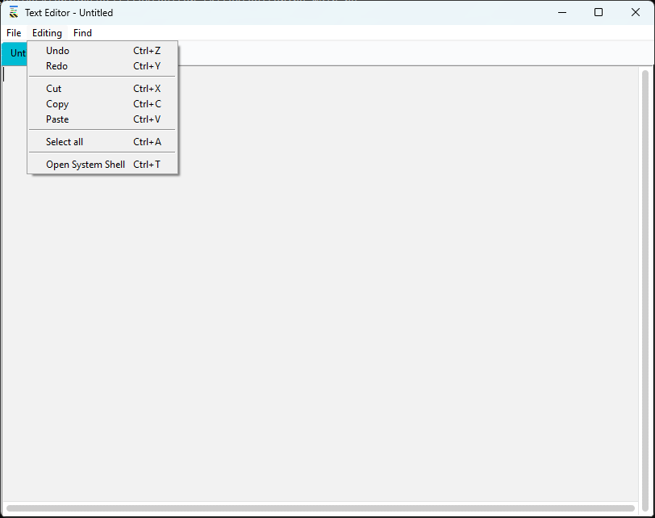

## Texteditor
<div align="center">
    
    
</div>

<style>
    img {
        border-radius: 8px;
    }
</style>

A graphical user interface (GUI) text editor.


## Features
* Tabs support (tabs dragging taken from dh7qc's [text editor](https://github.com/dh7qc/Python-Text-Editor))
* Fast
* [Working] Dark mode + Text colors support
* [Working] Configuration file support
* Able to make Windows executable file (.exe)
* Command window where you can run external commands (except Console apps which require you inputs)

> Note: This project also available on GitLab with this [link](https://gitlab.com/lebao3105/texteditor_tk)

## Running
Use python3's pip module:
```
pip install -i https://test.pypi.org/simple/ texteditor
```

Then run:
```
python3 -m texteditor
```

## Running from source
This project needs Python 3 with Tkinter and pip installed. Use pip to install configparser.

If needed, let this app speak your language. On Linux, use [```upd_trans.sh```](upd_trans.sh) should work:
```
./upd_trans.sh -upd
# If you see wrong text, do:
./upd_trans.sh -tep # Generate new .pot file
# Translate the application by editing <language code>/LC_MESSAGES/base.po, then save it:
./upd_trans.sh -upd
```

On Windows, find pygettext & msgfmt from your Python installation folder. Then use them:
```
REM Generate .pot + .po files
pygettext.py -d base -o po/base.pot texteditor/mainwindow.py texteditor/tabs.py texteditor/miscs/file_operations.py texteditor/extensions/finding.py texteditor/extensions/cmd.py
REM Copy .pot file to your_language_code/LC_MESSAGES/ then rename it to base.po
REM edit your .po files, then generate .mo files. This use 
REM for all available languages here.
msgfmt.py po/vi/LC_MESSAGES/base -o po/vi/LC_MESSAGES/base.mo
msgfmt.py po/en/LC_MESSAGES/base -o po/en/LC_MESSAGES/base.mo
```

Once done, run ```python3 -m texteditor```.

To make executable files, read instructions in [makerelease](makerelease/).

## Screenshots
<div align="center">
    
    
    
</div>

## UI on Linux
It's ugly here... If you don't like this, try to find some ttk theme on the internet, download it to somewhere safe.

Then add the following code (just an example) to texteditor/mainwindow.py:

> Add codes before ```self.place_widgets()``` line!
```
style = ttk.Style(self)
self.tk.call('source', '{tcl file location}')
style.theme_use('{theme name}')
```

Or use the instructions from the theme's author.

Tabs dragging is not working at this time.
